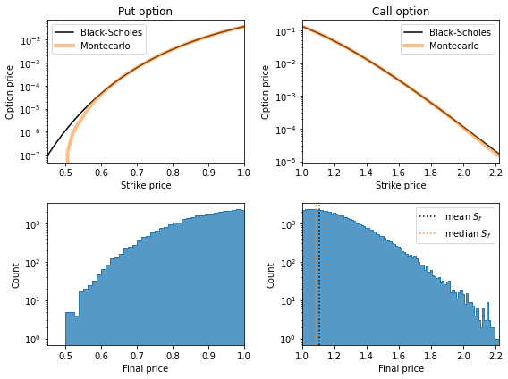
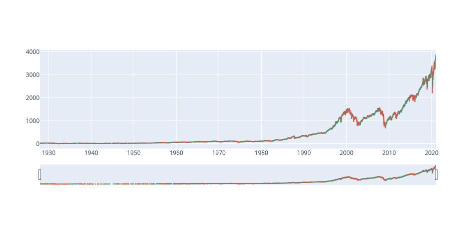

# Finance scripts
Some notebooks with simple financial analysis. Theoretical tools and data analysis.

**Disclaimer**: I have no background in finance, my expertise is in statistical physics and stochastic processes.
The scripts shared here respond to projects driven by my own curiosity on the subject.

The notebooks included are

- `pricing_options.ipynb` Using a geometrical brownian motion as model of the evolution of 
the price of an asset, we compare the use of Montecarlo and Black-Scholes formula to price options.

- `SP500_returns.ipynb` But for most investors, in fact playing with options is a terrible idea.
Instead, a practical strategy is to just drip-feed into a globally diversified index fund. 
In this script I analyze the past performance of the SP-500.
- 
